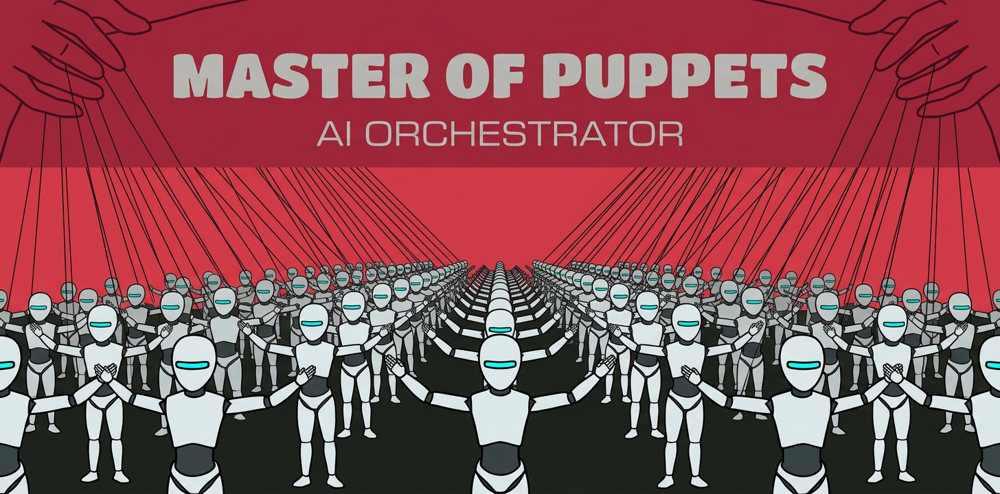

# MOP - Master Of Puppets

<p align="center">
  
</p>

Пул claude-папетов: управляющая машина (мастер) раздаёт задачи, а сессии
claude code на остальных машинах (папеты, на узлах пула) их делают.

Папет живёт в tmux на узле и работает с собственной рабочей копией (worktree) проекта.
Проект здесь называют шардом: папеты одного репозитория образуют срез пула,
и мастер этого проекта видит только его, чужие для него не существуют.

Узел пула — машина с Debian (папеты работают как процессы в общей среде)
или гипервизор Proxmox (на нем каждый папет изолирован в LXC контейнерах)

## Установка

1. Клонировать репозиторий и вывести команду наружу:

       git clone <адрес> ~/mop
       sudo ln -s ~/mop/bin/mop /usr/local/bin/mop

   Всё запускается через `mop <подкоманда>`

2. Настроить окружение установки. Три файла, у каждого свой вопрос; ни один
   в git не попадает, рядом с каждым лежит пример:

       cp .env.example .env && chmod 600 .env
       cp inventory.yaml.example inventory.yaml
       cp setup.yaml.example setup.yaml

   **`.env` — что знает УСТАНОВКА.** Обязательных настроек две:
   `MOP_SERVER_LAN` — адрес сервера в локальной сети (на него ходят и узлы,
   и мастер), `MOP_GIT_HOST` — хост, с которого папеты клонируют проекты.
   Из остального обычно вписывают ключ LLM-провайдера (например, `Z_AI_KEY`),
   если папеты работают не через подписку claude.ai. Весь словарь настроек с
   дефолтами показывает `mop config`. На узлы этот файл не едет никогда:
   туда уходит только поимённый срез.

   **`inventory.yaml` — какие есть МАШИНЫ.** Впишите свои и раскидайте по
   ролям: `server` (Nomad и шина), `puppet` (узлы пула), `master`
   (управляющая машина), `hypervisor` (Proxmox, где папет живёт в LXC).
   Одна машина может быть в нескольких ролях. Имя машины здесь одно на всё —
   адрес, порт и ключ для него знает ваш `~/.ssh/config`.

   **`setup.yaml` — окружение ТЕЛ, общее всем проектам установки:** тулчейн,
   ваши скиллы, ваши MCP-серверы. Это список задач ansible, который
   проигрывается на узлах и при сборке образа; в примере лежит окружение
   чужой установки — выкиньте из копии лишнее и впишите своё. Подключён
   настройкой `MOP_BODY_EXTRA`; пусто в ней — тела получают только
   обязательное. Нужное ОДНОМУ проекту сюда не пишут: это `.mop/` в самом
   проекте.

3. Развернуть пул:

       mop deploy

   Один прогон ставит всё в правильном порядке: кластер Nomad, окружение
   узлов, шину с агентом и сторожем диска. Прогон идемпотентен и всегда
   полный: чинить упавшее проще им же, чем выбором цели.

   Новый шард заводят аргументом: `mop deploy <git-origin>`. Что шард просит
   от узла и что ему нужно в рабочей копии, он приносит с собой — `.mop/`
   в его репозитории: `node.yaml` (ресурсы тела) и `workspace.yaml` (сервисы,
   env-файлы). Для шардов на гипервизоре образ собирается отдельно:
   `mop driver build <git-origin>`.

4. Залогинить claude: `claude login` на управляющей машине, затем `mop login` раздаст логин claude.ai и ключи LLM на узлы пула.

Готовность проверяют `mop list` (пул собран, агенты живы) и `mop doctor` (диагностика целиком).

## Использование

Запустите `mop master` в рабочей копии проекта, она запустит claude code с нужной конфигурацией.

Затем используйте скилл `/master` в для разбора и оркестарции задач, например:

```
> /master Дай мне на разбор первую задачу из трекера.
...
Я разобрал задачу, вот её суть и предложенный фикс. Одобряешь или правим?
...
> Одобряю
...
Задача одобрена, отдаю ее в пул. Жду отчета от папетов.
...
Задача выполнена, реализация проверена. Выдаю landing-токен.
...
Задача успешно приземлена в интеграционную ветку.
> Cледующая задача
```

### Мастер: `mop master` + скилл `/master`

В рабочей копии проекта `mop master` поднимает claude с кредами шарда:
сессия видит только папетов этого проекта — ростер, состояние, переписку.
Запусти в ней скилл `/master` - и она начнет цикл работы (скилл живёт в
`skills/master`):

* держит очередь заявок трекера и разбирает их с тобой по одной: суть
  человеческим языком, свидетельства, предлагаемый фикс — ты одобряешь или
  правишь; ничего не уходит в работу без одобрения;
* диспатчит одобренное свободным папетам: каждый делает фикс в собственном
  клоне на своём узле и присылает отчёт — отчёт и есть сигнал;
* пропускает деплой через landing-токен: в интеграционную ветку
  садится по одному изменению, полный гейт гоняется на интегрированном
  результате;
* сам держит размер пула: заводит папетов под одобренную работу, отпускает,
  когда очередь кончилась, лечит залипших и следит за пайплайном.

### Командная строка: `mop <подкоманда>`

Полный список подкоманд даёт `mop` без аргументов. Чаще прочего:

```
mop list                   ростер в терминале (в сессии — инструмент agents)
mop shards                 какие шарды уже заведены в пуле
mop attach <имя>           живой терминал папета (ssh + tmux)
mop deploy <git-origin>    завести новый шард — проект в пуле
mop driver build <origin>  собрать образ шарда на гипервизорах (LXC)
mop node                   узлы пула: драйвер, шарды, ёмкость; вывод узла
mop recycle <имя>          пересоздать папета на чистой рабочей копии
mop disk / mop gc          место на узлах, подробности — docs/GC.md
```

### Модели


`mop llm` перечисляет профили, которыми поднимают папетов, и показывает, чей ключ есть в `.env`. 
Профиль выбирают при создании папета (аргумент `llm`) и для сессии мастера (`mop master --llm ПРОФИЛЬ`).
`mop code --llm ПРОФИЛЬ` поднимает на том же профиле обычную сессию claude — без шарда, кредов шины и
MCP-сервера пула: когда нужна только модель, а пул к задаче отношения не имеет.

Сейчас поддерживается профиль claude (подписка) и glm (`Z_AI_KEY` в .env).
Новые профили легко добавляются в `mop/llm` по аналогии.

### Место на узлах

`mop disk` показывает свободное место, `mop gc` пересоздаёт свободных папетов на узлах, где его не хватает; занятых не трогает. 
Мусор в рабочих копиях подрезает сторож на узле сам, подробности в [docs/GC.md](docs/GC.md).

## Если что-то сломалось

Диагностика — `mop doctor` в терминале или инструмент `doctor` в мастер-сессии; `--fix` чинит то, что чинится само. 
Дороги на узел мимо шины нет: упавший агент и битые креды лечатся повторным `mop deploy`.
