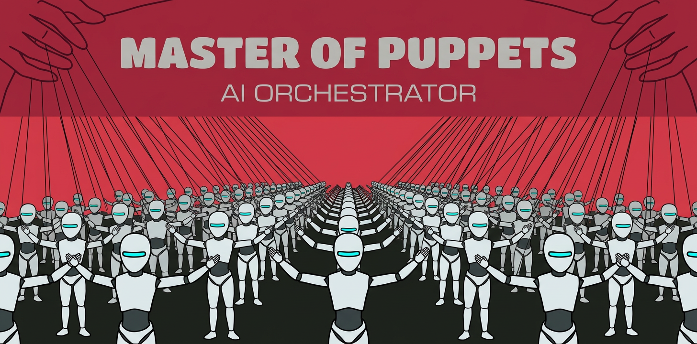

# MOP. Master of Puppets

<p align="center">
  
</p>

Рой ИИ агентов (папетов). Мастер раздаёт задачи, папеты на узлах пула их делают, оркестратор управяет ресурсами.

## Термины

- Сервер (server): главная машина пула, на ней живет оркестратор. На ней же, при помоищи `ansible` кофигурируют узлы пула
- Узел (node): машина пула, на которой живут папеты. Либо машина с Linux, где папеты работают процессами в общей среде, либо гипервизор Proxmox, где каждый папет изолирован в контейнере LXC.
- Песочница (sandbox): то, в чём папет работает - сgroup или LXC контейнер.
- Папет (puppet): агент, который делает задачу. Живёт в tmux на узле пула, работает в своей рабочей копии, о результате отчитывается мастеру по шине.
- Рабочая копия (workspace): собственный клон репозитория у папета на узле.
- Проект: один репозиторий в пуле. Папеты одного репозитория образуют срез пула, и мастер проекта видит только их.
- Мастер (master): сессия на машине оператора, которая держит очередь задач трекера, раздаёт их папетам и принимает отчёты.

## Установка

Установка из двух частей. Сервер держит пул: на нём шина и плейбуки, с него раскатывают узлы. Клиент - машина, с которой работают с пулом: на ней поднимают мастера. Сервер тоже может быть клиентом.

### Сервер

Требования: Linux-пользователю, под которым ставится mop, по ssh доступны все узлы пула и все git-репозитории, с которыми будет работать mop.

1\. Клонировать mop и добавить `mop/bin` в `PATH`. Всё запускается через `mop <подкоманда>`.

```
git clone <адрес> ~/mop
echo 'export PATH="$HOME/mop/bin:$PATH"' >> ~/.bashrc && . ~/.bashrc
mop server setup
```

`mop server setup` ставит ansible (Debian 13, через apt) и дальше настраивает саму машину: rsync, git, pip и python-библиотеки mop. Узлам пула всё поставит `mop server deploy`.

2\. Отредактировать файлы установки. Три файла, каждый копируется из примера и заполняется, в git они не попадают.

2.1. `.env`, настройки установки.

```
cp .env.example .env && chmod 600 .env
```

- `MOP_SERVER_LAN`, обязательная: адрес сервера в локальной сети. На него ходят и узлы, и клиенты.
- `MOP_GIT_HOST`, обязательная: хост, с которого папеты клонируют проекты.
- `MOP_GIT_KEY`, по умолчанию первый из `~/.ssh/id_ed25519`, `~/.ssh/id_rsa` на сервере: ключ, под которым узлы клонируют проекты. Его публичную часть зарегистрируйте на `MOP_GIT_HOST` с правом чтения всех проектов пула; нет ключа - `ssh-keygen -t ed25519`.
- Люди: не настройка, а провайдер личностей — файл операторов (шаг 2.4) или LDAP. Как устроен доступ и как подключить каталог — [docs/AUTH.md](docs/AUTH.md).
- LLM-прокси: клиентский ключ генерирует deploy и хранит закрыто на сервере; копировать его в `.env` не нужно (см. [docs/PROXY.md](docs/PROXY.md)).

Весь словарь с текущими значениями показывает `mop server config`.

2.2. `inventory.yaml`, машины и их роли, формат `Ansible`. Одна машина может быть в нескольких ролях.

```
cp inventory.yaml.example inventory.yaml
```

- `puppet`: узлы пула, на них живут папеты.
- `proxmox`: узлы Proxmox, где папет живёт в контейнере LXC. Такой узел перечисляют и в `puppet`. Каждому гипервизору здесь задают свою `mop_pve_vmid_base`: из неё считается и срез сети тел, и адрес каждого тела, так что на общей базе две машины выдали бы один адрес двум разным телам.

2.3. `sandbox.yaml`, песочница установки: окружение папетов, общее для всех проектов. Это список задач ansible, он печётся в образ проекта и проигрывается на узлах, где тело равно узлу.

```
cp sandbox.yaml.example sandbox.yaml
```

- Тулчейн, ваши скиллы, ваши MCP-серверы.
- В примере лежит окружение тестовой установки: выкиньте лишнее и впишите своё.
- Нужное одному проекту сюда не пишут, для этого есть `.mop/` в самом проекте.

2.4. Люди, у которых будет доступ к пулу. До первого `mop server deploy`: без единого человека он откажет.

```
mop server user add <логин> --role admin --name "Имя Фамилия" --email <почта>
```

- Роль `admin` — весь пул, `user --projects a,b` — названные проекты, `user --projects '*'` — все проекты без машин.
- Именем и почтой подписываются коммиты папетов этого человека.
- Каталог организации (LDAP, Active Directory) вместо файла, смена пароля, отзыв доступа — [docs/AUTH.md](docs/AUTH.md).

3\. Развернуть пул. Один прогон ставит кластер Nomad, окружение узлов, шину с агентом и сторожем диска. Прогон идемпотентен, упавшее чинят повторным запуском.

```
mop server deploy
```

### Клиент

1\. Поставить клиент пакетом из git одной командой: [uv](https://docs.astral.sh/uv/) заводит ему отдельное окружение со всеми библиотеками и кладёт `mop` в `PATH`. Нужен git-доступ к репозиторию mop. Самого uv нет — ставит одна команда: `curl -LsSf https://astral.sh/uv/install.sh | sh`, самодостаточный бинарник в `~/.local/bin`.

```
uv tool install git+ssh://git@ssh.sourcecraft.dev/ermakdev/mop.git
```

Вместо uv подойдёт `pipx install git+ssh://git@ssh.sourcecraft.dev/ermakdev/mop.git`. Клон с `mop setup` остаётся путём сервера и разработчика mop.

Клиент обновляется командой `uv tool upgrade mop` (или `pipx upgrade mop`), сервер раскатывает CI. Если клиент разошёлся с шиной сервера, лечится это обновлением клиента.

2\. Войти на сервер из git-рабочей копии проекта, с которым будете работать. Ввести пароль своего логина: `join` проверит шину, запросит URL и клиентский ключ прокси у сервера по личному защищённому адресу, проверит `/v1/models` и только затем сохранит настройки. При повторном входе действующий пароль не спрашивается, а сменившийся ключ обновляется.

```
cd ~/src/project
mop login --server <адрес сервера> <логин>
```

Рабочая копия запоминает сервер и логин; пароль шины и настройки прокси лежат в отдельных закрытых файлах `operator.json` и `client.json` под `~/.config/mop/servers/<сервер>/`. Логин и пароль заводит администратор сервера (или они из каталога организации) — [docs/AUTH.md](docs/AUTH.md). Для нескольких серверов называйте нужный через `--server`; установка `.env` клиенту не нужна.

3\. Начать работу: `mop master` в той же рабочей копии, дальше - раздел «Использование». Если вход ещё не сохранён, `mop master` (как и `mop code`) сам запустит `mop login` перед сессией; без терминала и недостающих данных он откажет. Если проект в пуле ещё не заведён, сначала «Подключение проекта».

## Подключение проекта

Проект должен быть доступен по git с `MOP_GIT_HOST`: узлы клонируют его сами.

1\. При необходимости положить в корень проекта каталог `.mop/` с двумя плейбуками ansible. Оба необязательны, многим проектам хватает общей песочницы установки из `sandbox.yaml`. Имя файла говорит, когда он играется.

1.1. `.mop/sandbox.yaml` используется для сборки в образа контейнера. В `vars` можно запросить ресурсы для папета, в `tasks` поставить системные пакеты и тулчейн проекта. Всё тяжёлое - сюда: оно платится один раз на образ.

```yaml
---
- name: What the project bakes into its sandbox
  vars:
    MOP_MEM_MB: "8192"
    MOP_DISK_GB: "50"
    MOP_CORES: "4"
  tasks:
    - name: Native build prerequisites
      ansible.builtin.apt:
        name: [protobuf-compiler, libssl-dev]
        state: present
```

1.2. `.mop/bootstrap.yaml` запускается при каждом старте песочницы, перед запуском папета. Сюда идёт то, что часто меняется.

2\. Завести проект в пуле. Команда заводит проекту пользователя на шине и раздаёт креды мастеру и папетам. Какие проекты уже заведены, показывает `mop project list`; `mop server deploy` настраивает машины и о проектах не знает.

```
cd ~/project
mop project add
```

## Использование

Запустите `mop master` в рабочей копии проекта. Поднимется claude code, который видит только папетов этого проекта: ростер, состояние, переписку.

В этой сессии скилл `/master` ведёт разбор и раздачу задач. Например:

```
> /master Дай мне на разбор первую задачу из трекера.
...
Я разобрал задачу, вот её суть и предложенный фикс. Одобряешь или правим?
...
> Одобряю
...
Задача одобрена, отдаю её в пул. Жду отчёта от папетов.
...
Задача выполнена, реализация проверена. Разрешаю влить её в интеграционную ветку.
...
Задача успешно приземлена в интеграционную ветку.
> Следующая задача
```

Скилл живёт в `mop/skills/master` и едет вместе с пакетом. Он держит очередь заявок трекера и разбирает их с вами по одной: суть, свидетельства, предлагаемый фикс. Ничего не уходит в работу без одобрения. Одобренное он раздаёт свободным папетам, каждый делает фикс в своём клоне и присылает отчёт. В интеграционную ветку изменения садятся по одному, через `merge --no-ff` и проверку на объединённом дереве; этот проект не держит landing-токен. Полный набор проверок гоняет CI после push. Размер пула скилл держит сам: заводит папетов под одобренную работу, отпускает их, когда очередь кончилась, лечит залипших.

### Командная строка

Полный справочник — [docs/CLI.md](docs/CLI.md): каждая команда и глагол с полным текстом справки, собранный из докстрингов командлетов (`mop dev docs`). Краткий список даёт `mop` без аргументов. Чаще прочего нужны:

```
mop master                 сессия мастера проекта этой рабочей копии
mop list                   ростер: кто где, занят или свободен (в сессии мастера — инструмент agents)
mop send <имя> <текст>     сообщение папету или сессии на этой машине
mop tail <имя>             хвост экрана папета; mop attach <имя> — живой терминал
mop add / mop recycle      завести папета / пересоздать его на чистой рабочей копии
mop stat                   расход токенов по пулу
mop server doctor [--fix]       диагностика пула на сервере
mop login                        войти на сервер и сохранить настройки прокси
mop project add [origin]   завести проект (без origin — эта рабочая копия)
mop server disk / gc / sweep     место на узлах и уборка, подробности в docs/GC.md
```

### Модели

Мастер, `mop code` и папеты работают через LLM-прокси сервера. На клиенте `mop master` и `mop code` получают адрес и ключ из `client.json` выбранного сервера, не из `.env`; `mop code` запускает обычную сессию без проекта, доступа к папетам и MCP-инструментов пула. При нескольких входах сервер выбирают через `--server`. Какие модели доступны, показывает панель прокси ([docs/PROXY.md](docs/PROXY.md)).

### Место на узлах

`mop server disk` показывает свободное место. `mop server gc` пересоздаёт свободных папетов на узлах, где места не хватает, занятых не трогает. Мусор в рабочих копиях подрезает сторож на самом узле, подробности в [docs/GC.md](docs/GC.md).

## Если что-то сломалось

Диагностика: `mop server doctor` на контроллере. У мастера нет доступа к общей уборке и диагностике. `--fix` чинит то, что чинится само. Другой дороги на узел, кроме шины, нет: упавший агент и битые креды лечат повторным `mop server deploy`.
